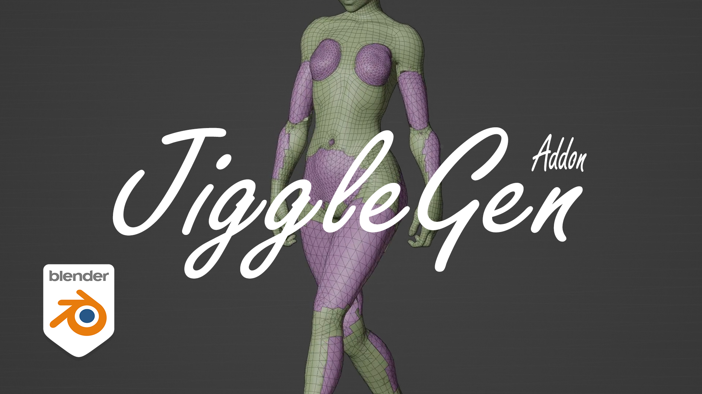

# JiggleGen-Documentary

JiggleGen is an addon that creates and manages proxy meshes for cloth simulations. With an integrated batch operation you can now generate every piece for your whole character. Ears, hair, dresses, braids, breasts, belts, butts and accesories, can now be generated within a couple of minutes. Don't worry anymore about Surface Deform & Collision modifiers, JiggleGen does that for you!

<b>[Get JiggleGen](https://pathnode.gumroad.com/l/jigglegen)

## :memo: Docs

<b>[Overview](/docs/Overview.md)

<b>[Quick-Start](/docs/Quickstart.md)

<b>[Installation](/docs/Installation.md)

<b>[Simulation Settings](/docs/Simulation-Settings.md)

<b>[Batch](/docs/Batch.md)

<b>[Troubleshoot](/docs/Troubleshoot.md)

## :bulb: Features

- Cloth & Collision Mesh from Vertex Groups Quickly generate simulation-ready cloth and collision geometry from any vertex group.
- Automatic Target AttachmentAttaches the target mesh to the generated cloth via a Surface Deform modifier—zero manual rigging required.
- Editable Pre-Generation Cloth SettingsAdjust cloth simulation parameters before mesh generation for total control and flexibility.
- Integrated Preset LibrarySave, load, and reuse cloth setups using Blender’s native preset system—no custom file management needed.
- Overwrite Existing MeshesRegenerate cloth/collision meshes without manual cleanup—perfect for fast iterations and testing.
- Structured Naming ConventionAuto-generates meaningful names for all objects and modifiers, based on origin mesh, vertex group, and preset.
- Vertex Group Fine-TuningControl simulation influence with two adjustable sliders: Threshold and Boost, for refined selection behavior.
- Optional Modifiers During Generation
- Decimate Modifier: Automatically reduce vertex count for performance.
- Smooth Modifier: Add surface smoothing for cleaner cloth deformation.
- Auto ParentingGenerated cloth mesh can automatically be parented to the target object.
- Compact Utility Panel with Smart ShortcutsA small, efficient UI panel with handy tools:
- Bake All Simulations
- Set Target Frame Range
- Toggle JiggleGen Sim Visibility
- Switch Between Pose & Rest Mode
- Copy Cloth Settings to Active Object

Batch
- Batch Cloth & Collision GenerationProcess multiple vertex groups or objects in a single batch—perfect for rigged characters with multiple dynamic areas.
- Per-Vertex Group Preset ApplicationAssign unique cloth presets to each selected vertex group for full customization.
- Batch Management PanelEasily review, modify, or regenerate all components of your model through an organized batch queue.
- Smart Collision ExclusionCreate a collision Mesh, which is the opposite of all selected vertex group mesh data—great for characters with both jiggly and > rigid areas.

## :hammer_and_wrench: Compability

Tested with Blender 4.0+, Blender 3.6+ probably works aswell.

## Support and Updates

For support, questions, or bug reports, please contact me through my social media pages.

https://x.com/path_node

https://bsky.app/profile/pathnode.bsky.social

https://www.patreon.com/c/pathnode

https://www.youtube.com/@pathnode

## 📄 License 

The documentation in this repository is licensed under CC BY-NC 4.0. The JiggleGen add-on itself is distributed under a separate commercial license via Gumroad
