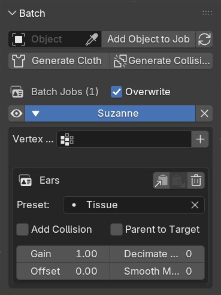
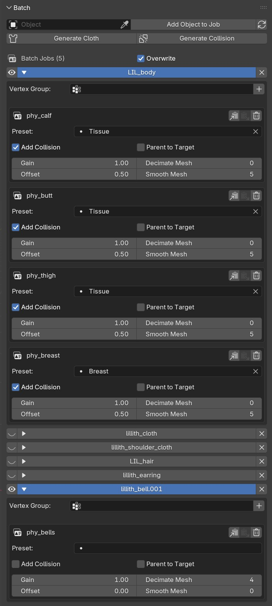

# Batch List

 

All Batch-Jobs are stored in the Batch-List. Each job can be expanded/condensed for better overview. The Eye-Icon marks wether or not it should be used for the batch operation.
A Batch-Job consists of a target object (Job) and its selected Vertex Groups (Entry). Each Entry will create an individual Proxymesh. 

```
Object A (Job)

-> Vertex Group 1A (Entry)

-> Vertex Group 2A (Entry)
```


```
Object B (Job)

-> Vertex Group 1B (Entry)

-> Vertex Group 2B (Entry)
````

# Batch Operation Modes

JiggleGen offers two types of batch operations: 'Cloth Generation' and 'Collision Generation'. 
Each operation produces one or more ProxyMeshes, which store the actual cloth or collision modifier. 
The original source object is then linked to the proxymesh via a 'Surface Deform' modifier. To maintain clarity, each generated object receives an automated, descriptive name.

Cloth Mesh: phy_[Source Object]_[Preset]

Collision Mesh: col_[Source Object]


## Generate Cloth

Each object in the Batch-List runs through an automated process:

1. The object is isolated and duplicated.
2. The selected Vertex Group is used as a mask to delete all other geometry from the proxy object.
3. All modifiers are removed, except for Armature (if present).
4. A Surface Deform Modifier is created and assigned to the Source/Target Object.
5. A Cloth Modifier is added, and the settings from the selected preset are applied.
6. Depending on the entry settings, Decimate and/or Smooth modifiers may be added.
7. The resulting Proxymesh is moved into the JiggleGen Collection.

## Generate Collision

Detailed batch process for each object in the batch list with Add Collision enabled:

1. The object is isolated and duplicated.
2. The mesh data outside the selected Vertex Groups is deleted. The remaining geometry is merged into a single Proxymesh.
3. All modifiers are removed, except for Armature (if present).
4. A Collision Modifier is added.
5. The resulting Proxymesh is moved into the JiggleGen Collection.


# Setup Batch-Jobs

1. Select an Object (or a set of objects) and add them to the batch list with `Add Object to Job`
2. Expand it and select a VertexGroup. Press the 'Plus'-Icon to create an Entry. You can Create as much Entries as you like.
3. Select your desired Preset or leave it blank to use the current values from the 'Simulation-Settings' Sub-Panel.
4. Press Generate Cloth

`Add Collsion`: Marks Entries that should be used for 'Generate Collsion'.

`Parent to Target`: The generated Proxymesh will be parented to the source mesh.

`Gain/Offset`: Adjusts the influences for the Pin-Group that will be used for the Cloth Modifier.

`Decimate`: Performs a Decimate Operation on the generated Proxymesh.

`Smooth Modifier`: Adds a Smooth Modifier on the generated Proxymesh.


Example:

 

