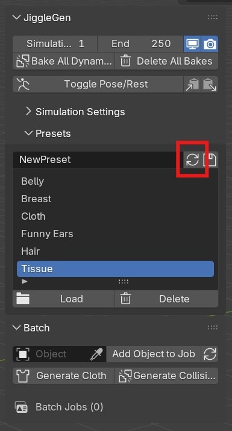

# Installation

1. Download the JiggleGen add-on as a .zip file from Gumroad. Do not unzip the file.

2. Open Blender.

3. In the top-left corner, go to Edit → Preferences.

4. In the Preferences window, select the Add-ons tab.

5. In the top-right corner, open the dropdown menu and choose Install from Disk….

6. Navigate to the downloaded .zip file and select it.

7. Confirm installation.

8. Once installed, activate the add-on by ticking the checkbox next to its name.

You can find JiggleGen in the N-Panel by pressing "N" in the viewport.

## Presets

JiggleGen can save and load cloth simulation presets within Blender’s native directory:

`C:\Users\user\AppData\Roaming\Blender Foundation\Blender\<version>\scripts\presets\cloth`

Inside the downloaded .zip file und 'presets', you will find a collection of ready-made presets.
To use them:

1. Extract only the presets from the .zip file.

2. Place them into the folder shown above.

3. Go to JiggleGen (N-Panel) and press the refresh icon under 'Presets'

The presets will then be available for selection in Blender’s cloth settings.
