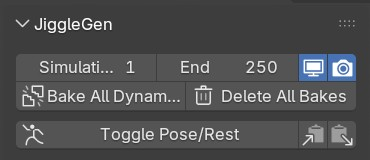
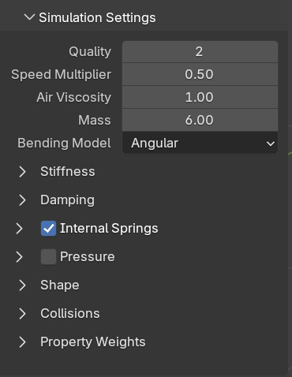
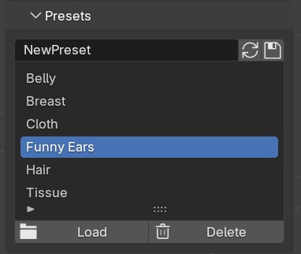

# Overview

## Header

The Header sets Global Settings for your generated meshes and can be used for animating and testing.

* Simulation Start/End: Define the simulation range > Hit `Bake All Dynamic` to bake this range with all cloth sim modifiers
* Bake All Dynamic: Bakes all cloth sim modifiers in this scene
* Delete All Bakes: Removes all cloth sim bakes from all modifiers
* Show in Viewport: Shows/Hides influences of all cloth modifiers on their target meshes in viewport
* Show in Render: Shows/Hides influences of all cloth modifiers on their target meshes in render view
* Toggle Pose/Rest: Sets all Armatures to Pose/Rest mode.
* Extract Cloth Settings: Takes all cloth modifier settings from active selected object (if possible).
* Paste Cloth Settings: Pastes simulation settings from Sub-Panel to an active selected object.

## Simulation Settings

All settings that cloth modifiers are providing are displayed here, with a slight visual upgrade.

## Presets

All values in the 'Simulation Settings' Sub-Panel can be loaded or saved in the Preset Section.

## Batch

All Batch-Jobs are stored in the Batch-List. Each Job can be expanded/condensed for better overview. The Eye-Icon marks wether or not it should be used for the batch operation. 
A Batch-Job consists of a target object (Job) and its selected Vertex Groups (Entry). For faster setup, all settings inside one Entry can be copied&pasted to an other Entry.
